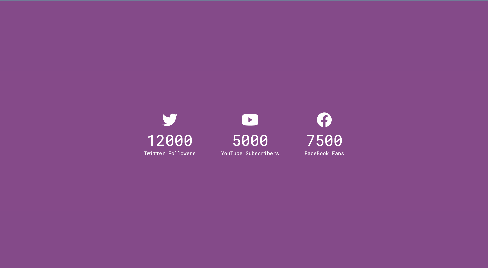

# 50 Projects in 50 Days - Incrementing Counter

This is a code along project in the [50 Projects In 50 Days - HTML, CSS & JavaScript Udemy Course](https://www.udemy.com/course/50-projects-50-days/). Sharpen your skills by building 50 quick, unique & fun mini projects.

## Table of contents 😌

- [Overview](#overview)
  - [The project](#the-project)
  - [Screenshot](#screenshot)
  - [Links](#links)
- [My process](#my-process)
  - [Built with](#built-with)
  - [What I learned](#what-i-learned)
  - [Continued development](#continued-development)
  - [Code snippets](#im-really-proud-of-these-code-snippets%EF%B8%8F)
  - [Useful resources](#useful-resources)
- [Author](#author)
- [Acknowledgments](#acknowledgments)

## Overview👋🏾

Welcome to the 15<sup>th</sup> mini-project of the course!

### The project😥

In this project users will be able to:

- Build a responsive site that displays an incrementing follower counter.

### Screenshot🌇



### Links👩🏾‍💻

- Live Site URL: (https://dynamic-panda-5d5392.netlify.app/)

## My process💭

This is a simple project that I started by marking out initial classes while building the structure of the html file to be later used for styling. Next I began styling the css by styling the background and creating media queries for responsiveness. I then added functionality by way of JavaScript to display each counter incrementally until reaching the grand total.

### Built with👷🏾‍♀️

- Semantic HTML5 markup
- CSS custom properties
- Flexbox
- JavaScript

### What I learned👩🏾‍🏫

I learned the logic behind making a simple incrementing function.

### Continued development🔮

In the future I plan on continuing to practice responsiveness by creating media queries at appropriate breakpoints.

I also plan on continuing to learn the best ways to phrase git commits, so that future viewers can fully understand the changes that have occurred.

### I'm really proud of these code snippets✂️

```js
const updateCounter = () => {
  // + easily converts the string into a number
  const target = +counter.getAttribute('data-target');
  const c = +counter.innerText;
  const increment = target / 200;

  if (c < target) {
    counter.innerText = `${Math.ceil(c + increment)}`;
    setTimeout(updateCounter, 1);
  } else {
    counter.innerText = target;
  }
};
```

### Useful resources📖

- [Resource](https://www.freecodecamp.org/news/how-to-write-better-git-commit-messages/) - This is an amazing article which helped me write better commit messages. I'd recommend it to anyone still learning this concept.

## Author🔎

- Website - [Portfolio Site](https://www.maiannethornton.com/Portfolio/index.html)
- Frontend Mentor - [@MaianneThornton](https://www.frontendmentor.io/profile/MaianneThornton)
- GitHub - [@MaianneThornton](GitHub.com/MaianneThornton)
- Twitter - [@MaianneThornton](https://twitter.com/MaianneThornton)
- LinkedIn - [@MaianneThornton](https://www.linkedin.com/in/maiannethornton/)

## Acknowledgments🙏🏾

Special Thanks go to [Brad Traversy](http://www.traversymedia.com/) and [Florin Pop](http://www.florin-pop.com/) creating the course and making reviewing concepts fun 😊.
